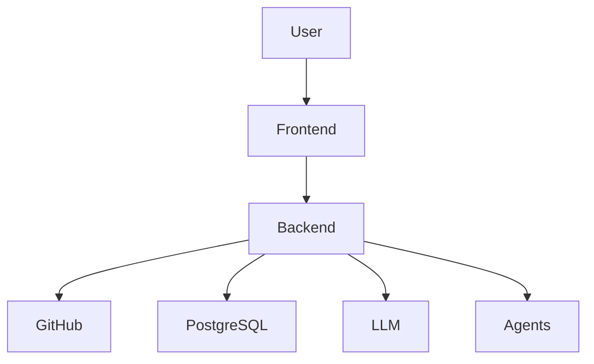

# System Design

ShipMind uses a Next.js frontend, a FastAPI backend, a PostgreSQL/pgvector data layer and a custom multi-agent workflow.

```mermaid
flowchart TD
  User --> Frontend
  Frontend --> Backend
  Backend --> GitHub
  Backend --> PostgreSQL
  Backend --> LLM
  Backend --> Agents
```
